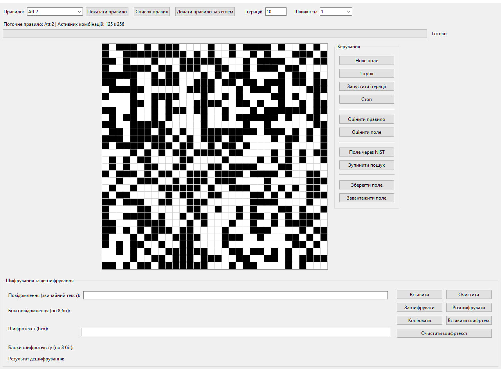
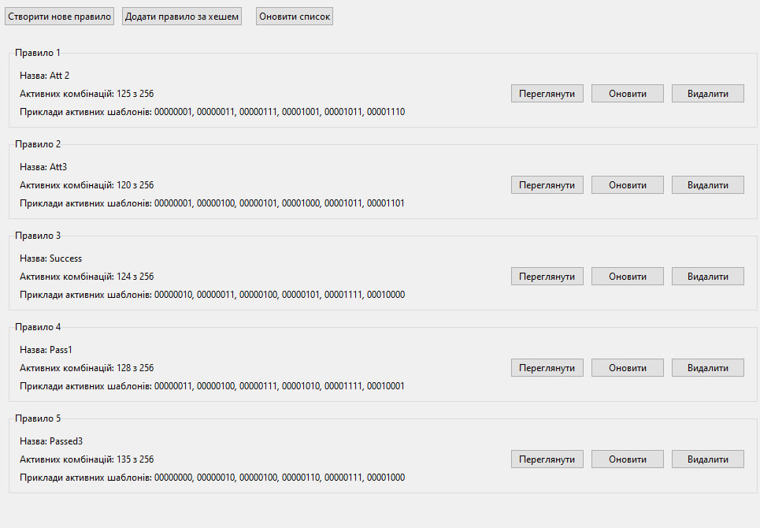
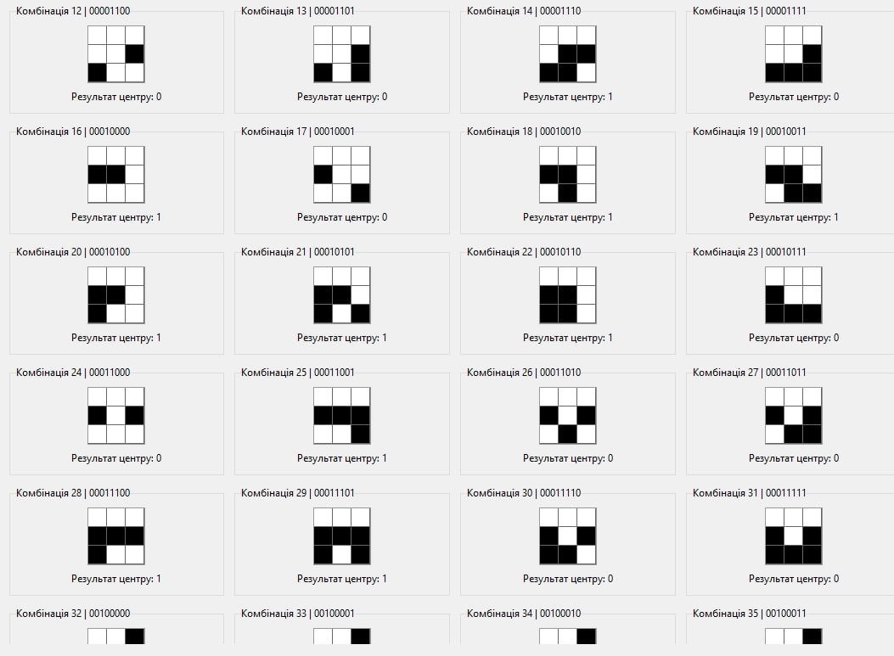
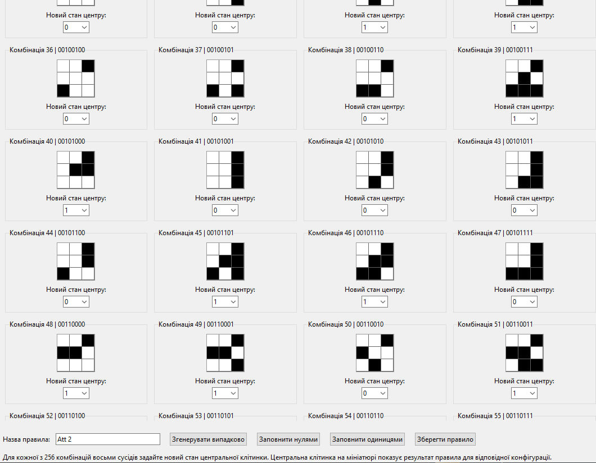
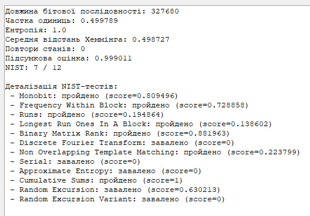
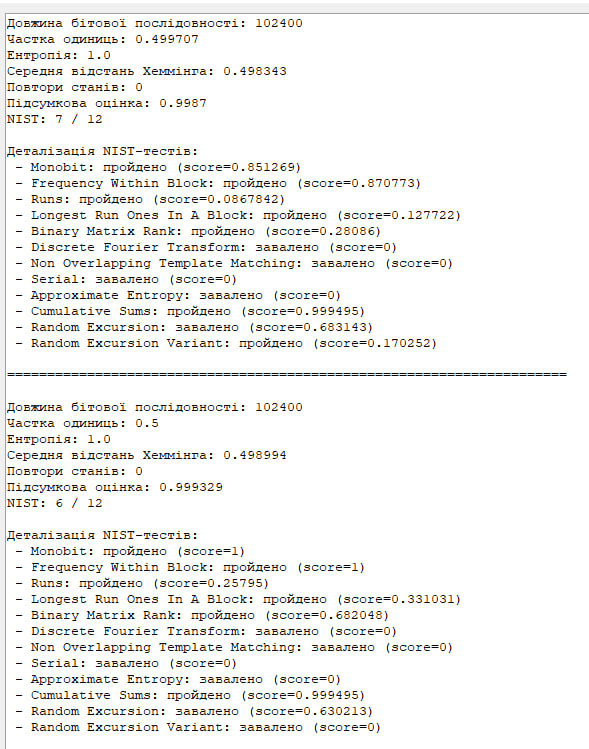
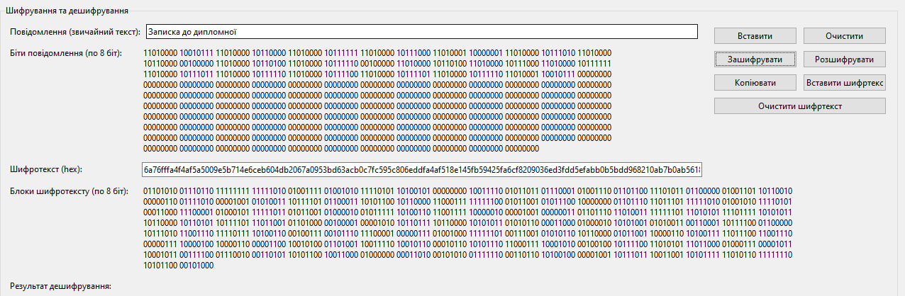
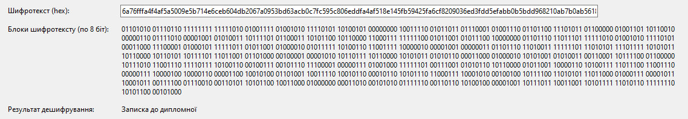

# CA_RuleFinder

Project Title: Cryptography System Based on the Use of Multidimensional Cellular Automata

Student and University: Yevhenii Suturin, Group 432, National University “Odesa Law Academy”, Faculty of Cybersecurity

## Project Overview
The multidimensional cellular automata cryptography system is designed for generating pseudorandom bit sequences and using them for data encryption. The project implements automated search for suitable cellular automata rules and statistical analysis of generated bit streams. The NIST SP 800-22 test suite is used to evaluate the cryptographic properties of generated sequences.

## Main Functionality
- Generation of pseudorandom bit streams based on cellular automata.
- XOR encryption and decryption of text messages.
- Automatic statistical analysis and NIST testing of generated bit sequences.

## Technology Stack
- Language: Python 3.10+.
- Libraries: tkinter, hashlib, json, random, statistics.
- Analysis Tools: NIST SP 800-22 Statistical Test Suite.
- Environment: Windows / Linux.

## Deployment Instructions
1. Requirements: Python 3.10+
2. Clone the repository:
```bash
git clone https://github.com/username/project-name.git
cd project-name
```
3. Install required dependencies:
```bash
pip install -r requirements.txt
```
4. Install and configure the NIST SP 800-22 Statistical Test Suite.
5. Specify the path to the NIST test directory in the application configuration.
6. Run the application:
```bash
python3 main.py
```

## Screenshots
### Main Application Window

The main application window provides interaction with the multidimensional cellular automata system. The user can select rules, generate new fields, launch iterations, perform statistical analysis, and execute encryption or decryption operations.


---

### Rule Management System

The rule management module allows users to create, edit, delete, and review cellular automata rules. Each rule contains information about active configurations and transition patterns used during field evolution.


---

### Cellular Automata Rule Visualization

The system includes a graphical rule editor for all 256 neighborhood configurations. Each pattern defines the next state of the central cell based on neighboring values.


---

### Rule Editing Interface

The editor allows manual modification of transition results for every local configuration. This enables experimental analysis of different automata behaviors and statistical properties.


---

### NIST Statistical Test Results

The application performs statistical analysis using the NIST SP 800-22 Rev. 1a test suite. The generated pseudorandom sequences are evaluated according to entropy, frequency balance, Hamming distance, and additional randomness criteria.


---

### Comparison of Field Generation Approaches

The system supports evaluation of multiple field generation approaches, including balanced and filtered configurations. Statistical characteristics and NIST results are displayed for comparative analysis.


---

### Encryption Process

The application converts plaintext into binary representation and performs XOR encryption using generated bit streams from the cellular automaton.


---

### Decryption Result

The decryption module reconstructs the original plaintext message using the same generated pseudorandom stream and XOR operation.



## Project Structure
```text
├── src/                  # Source code
├── screenshots/          # Screenshots used in README
├── rules/                # Saved cellular automata rules
├── requirements.txt
└── README.md
```
### Rules
The `rules/` directory contains saved cellular automata transition rules used for pseudorandom sequence generation and statistical analysis.

## Publication
Boyko V. D., Suturin Y. V. Encryption Procedure Using Two-Dimensional Cellular Automata // Cybersecurity in the Modern World: Current Challenges: Proceedings of the VI International Scientific and Practical Conference, November 28, 2025. — Odesa: National University “Odesa Law Academy”, 2025. — pp. 90–93.
[Read Publication](https://dspace.onua.edu.ua/handle/123456789/0000)
